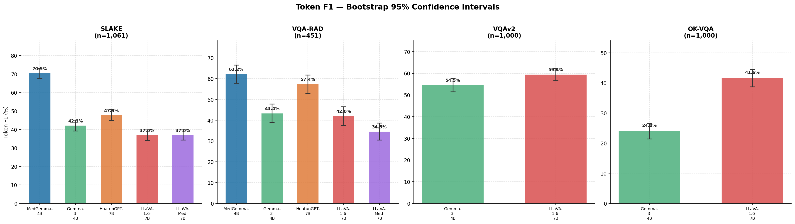
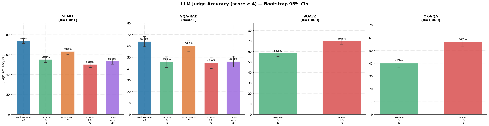
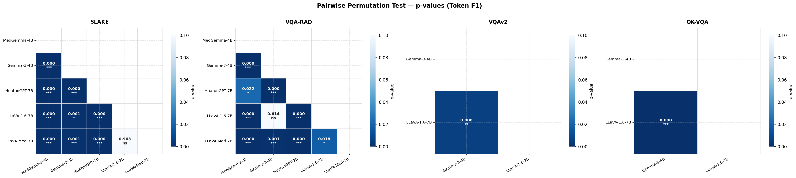
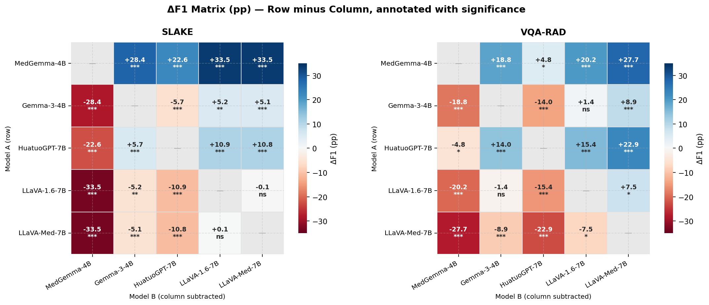
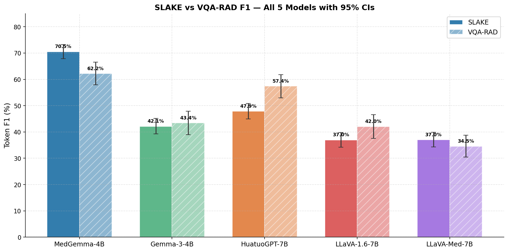

# Statistical Significance Testing — VLM Medical Benchmark

> **Method:** 95% Bootstrap Confidence Intervals (n=10,000 resamples, seed=42);
> two-sided Paired Permutation Tests (n=10,000 permutations, seed=42).
> Scores computed post-hoc on existing JSONL files in `outputs/inference/` — **zero re-inference**.
> Significance: \*p<0.05 · \*\*p<0.01 · \*\*\*p<0.001 · ns=not significant

---

## Coverage

| Dataset | Models evaluated | n | Notes |
|---|---|---|---|
| SLAKE | MedGemma-4B, Gemma-3-4B, HuatuoGPT-7B, LLaVA-1.6-7B, LLaVA-Med-7B | 1,061 | All 5 models |
| VQA-RAD | MedGemma-4B, Gemma-3-4B, HuatuoGPT-7B, LLaVA-1.6-7B, LLaVA-Med-7B | 451 | All 5 models |
| VQAv2 | Gemma-3-4B, LLaVA-1.6-7B | 1,000 | General-purpose only (by benchmark design) |
| OK-VQA | Gemma-3-4B, LLaVA-1.6-7B | 1,000 | General-purpose only (by benchmark design) |

---

## Figure 1 — Token F1 with 95% Confidence Intervals (all datasets)

---

## Figure 2 — Judge Accuracy with 95% Confidence Intervals

---

## SLAKE — Bootstrap 95% CIs (n=1,061)

| Model | F1 | 95% CI | Judge Acc | 95% CI |
|---|---|---|---|---|
| **MedGemma-4B** | **70.50%** | **[67.83%, 73.23%]** | **73.70%** | **[71.07%, 76.34%]** |
| HuatuoGPT-7B | 47.86% | [44.93%, 50.83%] | 63.15% | [60.32%, 65.98%] |
| Gemma-3-4B | 42.14% | [39.23%, 45.10%] | 55.14% | [52.21%, 58.15%] |
| LLaVA-Med-7B | 37.04% | [34.29%, 39.89%] | 53.35% | [50.33%, 56.46%] |
| LLaVA-1.6-7B | 36.98% | [34.17%, 39.80%] | 50.14% | [47.13%, 53.16%] |

### SLAKE — Pairwise Significance Tests

| Model A | Model B | ΔF1 (A−B) | p (F1) | Sig | p (Judge) | Sig |
|---|---|---|---|---|---|---|
| MedGemma-4B | Gemma-3-4B | +28.37 pp | 0.0000 | *** | 0.0000 | *** |
| MedGemma-4B | HuatuoGPT-7B | +22.64 pp | 0.0000 | *** | 0.0000 | *** |
| MedGemma-4B | LLaVA-1.6-7B | +33.52 pp | 0.0000 | *** | 0.0000 | *** |
| MedGemma-4B | LLaVA-Med-7B | +33.46 pp | 0.0000 | *** | 0.0000 | *** |
| Gemma-3-4B | HuatuoGPT-7B | −5.73 pp | 0.0000 | *** | 0.0000 | *** |
| Gemma-3-4B | LLaVA-1.6-7B | +5.16 pp | 0.0010 | ** | 0.0019 | ** |
| Gemma-3-4B | LLaVA-Med-7B | +5.09 pp | 0.0008 | *** | 0.3214 | ns |
| HuatuoGPT-7B | LLaVA-1.6-7B | +10.88 pp | 0.0000 | *** | 0.0000 | *** |
| HuatuoGPT-7B | LLaVA-Med-7B | +10.82 pp | 0.0000 | *** | 0.0000 | *** |
| **LLaVA-1.6-7B** | **LLaVA-Med-7B** | **−0.06 pp** | **0.9630** | **ns** | **0.0631** | **ns** |

---

## VQA-RAD — Bootstrap 95% CIs (n=451)

| Model | F1 | 95% CI | Judge Acc | 95% CI |
|---|---|---|---|---|
| **MedGemma-4B** | **62.19%** | **[57.88%, 66.52%]** | **63.86%** | **[59.42%, 68.29%]** |
| HuatuoGPT-7B | 57.40% | [52.92%, 61.77%] | 60.09% | [55.43%, 64.52%] |
| Gemma-3-4B | 43.39% | [38.94%, 47.86%] | 45.90% | [41.24%, 50.55%] |
| LLaVA-1.6-7B | 42.03% | [37.52%, 46.54%] | 45.01% | [40.35%, 49.67%] |
| LLaVA-Med-7B | 34.53% | [30.48%, 38.72%] | 46.34% | [41.69%, 51.00%] |

### VQA-RAD — Pairwise Significance Tests

| Model A | Model B | ΔF1 (A−B) | p (F1) | Sig | p (Judge) | Sig |
|---|---|---|---|---|---|---|
| MedGemma-4B | Gemma-3-4B | +18.80 pp | 0.0000 | *** | 0.0000 | *** |
| **MedGemma-4B** | **HuatuoGPT-7B** | **+4.78 pp** | **0.0216** | **\*** | **0.0672** | **ns** |
| MedGemma-4B | LLaVA-1.6-7B | +20.16 pp | 0.0000 | *** | 0.0000 | *** |
| MedGemma-4B | LLaVA-Med-7B | +27.66 pp | 0.0000 | *** | 0.0000 | *** |
| Gemma-3-4B | HuatuoGPT-7B | −14.01 pp | 0.0000 | *** | 0.0000 | *** |
| **Gemma-3-4B** | **LLaVA-1.6-7B** | **+1.36 pp** | **0.6137** | **ns** | **0.8101** | **ns** |
| Gemma-3-4B | LLaVA-Med-7B | +8.86 pp | 0.0009 | *** | 0.8133 | ns |
| HuatuoGPT-7B | LLaVA-1.6-7B | +15.37 pp | 0.0000 | *** | 0.0000 | *** |
| HuatuoGPT-7B | LLaVA-Med-7B | +22.88 pp | 0.0000 | *** | 0.0000 | *** |
| LLaVA-1.6-7B | LLaVA-Med-7B | +7.50 pp | 0.0176 | * | 0.6416 | ns |

---

## VQAv2 — Bootstrap 95% CIs (n=1,000)

| Model | F1 | 95% CI | Judge Acc | 95% CI |
|---|---|---|---|---|
| **LLaVA-1.6-7B** | **59.44%** | **[56.59%, 62.26%]** | **69.80%** | **[66.90%, 72.60%]** |
| Gemma-3-4B | 54.51% | [51.53%, 57.54%] | 58.30% | [55.20%, 61.30%] |

### VQAv2 — Pairwise Significance Tests

| Model A | Model B | ΔF1 | p (F1) | Sig | p (Judge) | Sig |
|---|---|---|---|---|---|---|
| Gemma-3-4B | LLaVA-1.6-7B | −4.93 pp | 0.0059 | ** | 0.0000 | *** |

---

## OK-VQA — Bootstrap 95% CIs (n=1,000)

| Model | F1 | 95% CI | Judge Acc | 95% CI |
|---|---|---|---|---|
| **LLaVA-1.6-7B** | **41.59%** | **[38.69%, 44.50%]** | **56.60%** | **[53.50%, 59.70%]** |
| Gemma-3-4B | 23.95% | [21.40%, 26.52%] | 40.00% | [37.00%, 43.00%] |

### OK-VQA — Pairwise Significance Tests

| Model A | Model B | ΔF1 | p (F1) | Sig | p (Judge) | Sig |
|---|---|---|---|---|---|---|
| Gemma-3-4B | LLaVA-1.6-7B | −17.64 pp | 0.0000 | *** | 0.0000 | *** |

---

## Figure 3 — Pairwise P-value Heatmaps (Token F1)

Lower-triangular matrix. Darker blue = lower p-value = stronger significance.

---

## Figure 4 — ΔF1 Heatmaps with Significance Stars (Medical Datasets)

Each cell = F1(row model) − F1(column model) in percentage points, annotated with significance stars.
Red = row model is worse; blue = row model is better.

---

## Figure 5 — Cross-Dataset F1 Comparison (SLAKE vs VQA-RAD)

All 5 models side-by-side on both medical datasets, with 95% CI error bars.

---

## Key Scientific Findings

### Finding 1 — LLaVA-Med is indistinguishable from LLaVA-1.6 on SLAKE (F1 p=0.963, ns)
The −0.06 pp gap between LLaVA-Med-7B and LLaVA-1.6-7B on SLAKE F1 is **statistically indistinguishable from noise**. Medical fine-tuning on PMC-15M confers zero zero-shot advantage over the general-purpose model on this metric. This is further confirmed by Judge Accuracy (p=0.063, ns).

### Finding 2 — MedGemma vs HuatuoGPT is only marginally significant on VQA-RAD (F1 p=0.022, *)
Despite a 4.78 pp F1 gap, this is the weakest significance in the medical dataset comparisons. Critically, by **Judge Accuracy** the gap vanishes entirely (p=0.067, ns), meaning the LLM judge considers them semantically equivalent. HuatuoGPT-7B is a genuine challenger to MedGemma-4B on radiology.

### Finding 3 — General-purpose model size does not help on radiology (VQA-RAD, p=0.614, ns)
Gemma-3-4B and LLaVA-1.6-7B are statistically equivalent on VQA-RAD F1 (p=0.614) and Judge Acc (p=0.810). Doubling parameter count provides no benefit without domain knowledge.

### Finding 4 — Gemma-3 F1 > LLaVA-Med F1 on SLAKE, but Judge sees them as equal (p=0.321, ns)
Despite Gemma-3-4B having +5.09 pp F1 over LLaVA-Med, the LLM judge does not find a significant semantic difference (p=0.321, ns). This confirms that the F1 gap reflects LLaVA-Med's verbose output style being penalised by token matching, not a real knowledge gap.

### Finding 5 — Largest gap in the benchmark: LLaVA-1.6 vs Gemma-3 on OK-VQA (+17.64 pp, p<0.001)
On knowledge-based VQA, the 7B general model comprehensively outperforms the 4B model on both F1 and Judge Accuracy. This is the only domain where parameter count shows a clear, significant effect — suggesting general world-knowledge reasoning scales with size even in the absence of domain fine-tuning.

---

## Methodology

All reported differences were subjected to post-hoc statistical testing on per-sample prediction JSONL files without re-inference. 95% bootstrap confidence intervals were computed using 10,000 resamples (seed 42). Statistical significance between model pairs was assessed via two-sided paired permutation tests (10,000 permutations, seed 42); pairing is valid because all models evaluated identical question sets. Significance thresholds: * p < 0.05, ** p < 0.01, *** p < 0.001; ns denotes p ≥ 0.05. Full implementation is in `notebooks/06_statistical_significance.ipynb`.

---

## Generated Outputs

| File | Description |
|---|---|
| [`results/ci_results.csv`](../results/ci_results.csv) | Per-model CI values for all datasets (CSV) |
| [`results/statistical_significance_results.json`](../results/statistical_significance_results.json) | Full CI + p-value data (JSON) |
| [`results/fig1_f1_ci_bars.png`](../results/fig1_f1_ci_bars.png) | Figure 1 — F1 CI bar charts |
| [`results/fig2_judge_ci_bars.png`](../results/fig2_judge_ci_bars.png) | Figure 2 — Judge Acc CI bar charts |
| [`results/fig3_pvalue_heatmaps.png`](../results/fig3_pvalue_heatmaps.png) | Figure 3 — P-value heatmaps |
| [`results/fig4_delta_f1_heatmaps.png`](../results/fig4_delta_f1_heatmaps.png) | Figure 4 — ΔF1 annotated heatmaps |
| [`results/fig5_cross_dataset_comparison.png`](../results/fig5_cross_dataset_comparison.png) | Figure 5 — Cross-dataset F1 comparison |
| [`notebooks/06_statistical_significance.ipynb`](../notebooks/06_statistical_significance.ipynb) | Notebook that generated all of the above |

---

## Significance Legend

| Symbol | Threshold |
|---|---|
| `***` | p < 0.001 |
| `**` | p < 0.01 |
| `*` | p < 0.05 |
| `ns` | p ≥ 0.05 |
